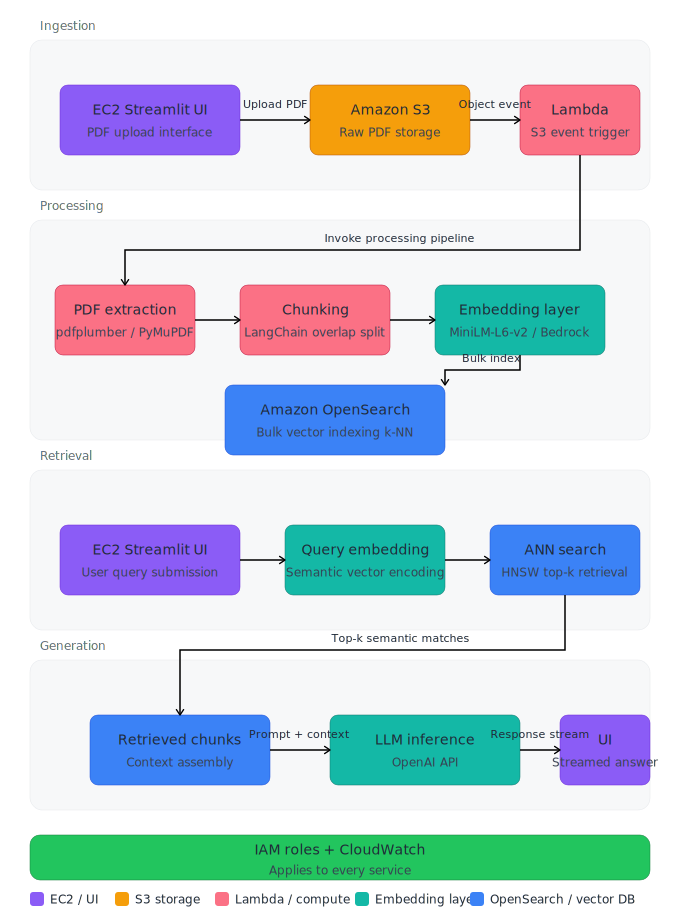

# Document Co-Pilot — RAG-based AI Assistant


> An end-to-end Retrieval-Augmented Generation (RAG) system that lets you upload any PDF and have an intelligent conversation with its contents — powered by semantic vector search and large language models.

---

## Table of Contents

- [Overview](#overview)
- [System Architecture](#system-architecture)
- [Pipeline Walkthrough](#pipeline-walkthrough)
- [Tech Stack](#tech-stack)
- [Project Structure](#project-structure)
- [Getting Started](#getting-started)
- [Configuration](#configuration)
- [Future Roadmap](#future-roadmap)

---

## Overview

Document Co-Pilot solves a common but painful problem: extracting precise, contextual answers from long, dense PDF documents. Traditional keyword search fails when the user's question doesn't match the exact wording in the document. This system instead converts both documents and queries into dense vector representations, finds semantically similar passages, and uses an LLM to synthesize a coherent, grounded answer.

The core insight behind RAG (Retrieval-Augmented Generation) is that you don't need to fine-tune a model on your data — you just need to retrieve the right context at inference time. This makes the system fast to build, cheap to operate, and easy to update as documents change.

---

## System Architecture


---

## Pipeline Walkthrough

### 1. Ingestion

PDF files are uploaded through the Streamlit interface and processed using `pdfplumber` and `PyMuPDF`. The ingestion layer preserves page-wise structure, which is stored alongside each chunk as metadata. This allows the system to cite source pages in retrieved answers.

**Module:** `src/ingestion.py`

### 2. Chunking

Raw extracted text is split into overlapping chunks. Overlap is critical — it ensures that sentences spanning a chunk boundary aren't lost, and that relevant context isn't artificially cut off. Chunk size and stride are configurable in `config.py`, allowing tuning for different document types (dense research papers vs. sparse slide decks).

**Module:** `src/chunking.py`

### 3. Embedding

Each chunk is encoded into a 384-dimensional dense vector using `sentence-transformers/all-MiniLM-L6-v2`. This model strikes a strong balance between speed and retrieval quality for English-language documents. The same model is used at query time, ensuring the embedding space is consistent between documents and queries.

**Module:** `src/embeddings.py`

### 4. Indexing

Embeddings and their associated metadata (chunk text, page number, source filename) are bulk-indexed into OpenSearch with k-NN enabled. Bulk indexing dramatically reduces round-trip overhead compared to single-document inserts, making ingestion of large documents practical in real time.

**Module:** `src/indexing.py`, `src/opensearch_client.py`

### 5. Retrieval

At query time, the user's question is embedded using the same SentenceTransformer model. OpenSearch performs an approximate nearest-neighbor search (using HNSW) to retrieve the top-k most semantically similar chunks. This is fundamentally different from BM25 keyword search — a question like *"What are the risks?"* will correctly retrieve chunks discussing *"potential downsides"* or *"hazards"* even without exact term overlap.

**Module:** `src/retrieval.py`

### 6. Generation

The retrieved chunks are assembled into a structured prompt and passed to OpenAI's GPT model. The prompt instructs the model to answer strictly from the provided context, reducing hallucination. The final answer is streamed back to the Streamlit UI.

**Module:** `src/generation.py`

---

## Tech Stack

| Layer | Technology | Purpose |
|---|---|---|
| UI | Streamlit | Interactive web interface |
| Visualization | Plotly | Pipeline flowchart + step tracking |
| PDF Parsing | pdfplumber, PyMuPDF | Text + page extraction |
| Chunking | LangChain text splitters | Overlapping chunk strategy |
| Embeddings | SentenceTransformers (`all-MiniLM-L6-v2`) | Dense vector encoding |
| Vector DB | OpenSearch (k-NN) | Similarity search at scale |
| LLM | OpenAI GPT | Grounded answer generation |
| Config | python-dotenv | Environment variable management |
| Future Cloud | AWS (S3, Lambda, EC2/ECS, Secrets Manager) | Scalable deployment |

---

## Project Structure

```
DOCUMENT-COPILOT-E2E/
│
├── app.py                  # Streamlit entrypoint
├── config.py               # Centralized configuration (chunk size, model names, etc.)
├── requirements.txt        # Python dependencies
├── setup.py                # Package setup
├── template.sh             # Project scaffolding script
│
├── src/
│   ├── ingestion.py        # PDF loading and page-wise text extraction
│   ├── chunking.py         # Overlapping text splitting
│   ├── embeddings.py       # SentenceTransformer encoding
│   ├── indexing.py         # Bulk indexing into OpenSearch
│   ├── retrieval.py        # k-NN semantic search
│   ├── generation.py       # LLM prompt construction and response generation
│   └── opensearch_client.py# OpenSearch connection and index management
│
├── research/               # Notebooks and experiments
│
└── README.md
```

---

## Getting Started

### Prerequisites

- Python 3.10+
- A running OpenSearch instance (local Docker or AWS OpenSearch Service)
- An OpenAI API key

### Installation

```bash
git clone https://github.com/titan-exasaur/DOCUMENT-COPILOT-E2E.git
cd DOCUMENT-COPILOT-E2E

python -m venv venv
source venv/bin/activate  # Windows: venv\Scripts\activate

pip install -r requirements.txt
```

### Running locally

```bash
# 1. Start OpenSearch (Docker)
docker run -p 9200:9200 -e "discovery.type=single-node" \
  opensearchproject/opensearch:latest

# 2. Set environment variables
cp .env.example .env
# Edit .env with your OpenAI API key and OpenSearch host

# 3. Launch the app
streamlit run app.py
```

---

## Configuration

Key parameters are centralized in `config.py`:

```python
CHUNK_SIZE      = 500    # Characters per chunk
CHUNK_OVERLAP   = 50     # Overlap between adjacent chunks
EMBEDDING_MODEL = "all-MiniLM-L6-v2"
TOP_K           = 5      # Number of chunks to retrieve per query
OPENSEARCH_HOST = "localhost"
OPENSEARCH_PORT = 9200
```

---

## Future Roadmap

### AWS Deployment

The production target is a fully managed, serverless-first architecture on AWS. OpenSearch would move to Amazon OpenSearch Service (managed k-NN), eliminating operational overhead. The Streamlit app (or a FastAPI replacement) would run in a Docker container on ECS Fargate, fronted by an Application Load Balancer. All secrets (OpenAI key, OpenSearch credentials) would be injected via AWS Secrets Manager rather than environment variables.

### Event-driven Ingestion via Lambda

Rather than triggering ingestion through the UI, the production pipeline would be S3-event-driven. A user uploads a PDF to an S3 bucket, which triggers a Lambda function that handles extraction, chunking, embedding, and indexing automatically. This decouples ingestion from the serving layer, allows parallel processing of multiple documents, and removes the 15-minute Lambda timeout constraint by offloading heavy embedding to an ECS task if needed.

### FastAPI Backend Separation

The current architecture embeds pipeline logic directly in Streamlit. A production system would separate this into a FastAPI backend with explicit endpoints (`/ingest`, `/query`) and a thin frontend. This enables independent scaling, easier testing, proper API versioning, and the ability to power multiple frontends (web, API clients, Slack bots) from a single backend.

### Scaling the Vector Store

For corpora beyond a few hundred documents, OpenSearch would be configured with dedicated primary and replica shards, and the k-NN index would be tuned (HNSW `ef_construction`, `m` parameters) for the trade-off between recall and query latency. For very large scale, an alternative like Amazon OpenSearch Serverless or a dedicated vector DB (Pinecone, Weaviate) would be evaluated.

### CI/CD Pipeline

A GitHub Actions workflow would run linting, unit tests (chunking correctness, embedding shape checks), and integration tests against a local OpenSearch container on every pull request. On merge to `main`, a Docker image would be built and pushed to ECR, with ECS automatically pulling the latest image.

---

## Author

**titan-exasaur** — [GitHub](https://github.com/titan-exasaur)

---

*Built to demonstrate end-to-end ML system design: from raw PDF bytes to LLM-generated answers, with a clear path to production.*
